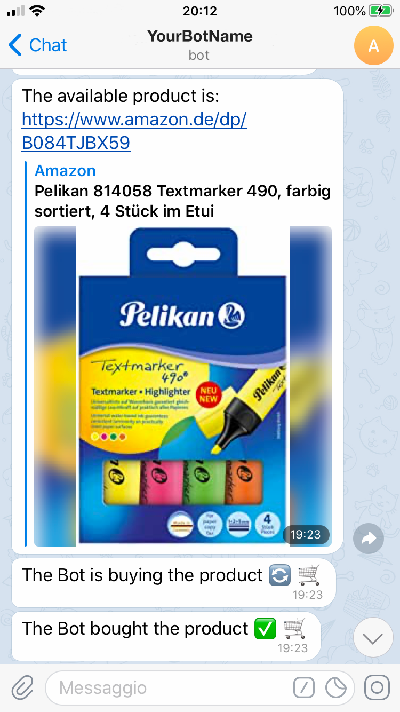

# AmazonAutoBuy
[](https://www.apple.com/it/macos/big-sur/)
[](https://www.raspberrypi.org/software/)
[](https://pypi.org/project/beautifulsoup4/)
[](https://pypi.org/project/selenium/)
[](https://pypi.org/project/twilio/)
[](https://opensource.org/licenses/mit-license.php)

<p align="center">
  
</p>


## **General** **Description**

**AmazonAutoBuy**, as the name suggests, is a Python script that operates on **Amazon's e-commerce**.

This **Python** script has two main features:

- Check the availability of one or more products;
- Automatically buy a product as soon as it becomes available.

## **How does it work**

**1)** A user inserts in a list all the URLs related to the products he wants to buy, which are currently not available on Amazon.

`urls = ["https://www.amazon.it/dp/B08HN4DSTC", …]`

**2)** The user decides the maximum prices (one for each product), beyond which the bot does not buy the products.

`MAX_PRICE = [500, ...]`

**3)** The user runs the code, which will not stop until all the products have gradually become available and has acquired them all automatically.

In addition to using the autobuyer, the user can still decide to receive a **notification** when the product becomes available. To do this, you can use two types of notifications:

- A notification with a custom **Telegram bot**, or
- A call to your mobile with **Twilio**.

### **Case 1: Notification with Telegram**

First you need to create a Telegram bot, to do this you can use this simple guide from this link:

[How to create a Telegram bot, and send messages with Python](https://medium.com/@ManHay_Hong/how-to-create-a-telegram-bot-and-send-messages-with-python-4cf314d9fa3e)

Then you can set with your specific data the fields related to:

- *bot_token*
- *bot_chat_id*

### **Case 2: Call with Twilio**

Twilio allows software developers to programmatically make and receive phone calls, send and receive text messages, and perform other communication functions using its web service APIs.

First of all you need to create a Twilio account from this link:

[https://www.twilio.com/login](https://www.twilio.com/login)

After creating an account, Twilio provides you with a phone number with which you will be called. From the dashboard you can find data related to:

- *twilio_sid*
- *twilio_token*
- *twilio_number*

## **Project Implementation**

The project consists of two Python files:

- `CheckAvailabilityAutoBuy.py`
- `secrets.py`

### CheckAvailabilityAutoBuy.py

The `CheckAvailabilityAutoBuy.py` file contains all the main functions of the project, which are:

- A function to send a message on Telegram

```python
def telegram_bot_sendtext(bot_message):
	'''some code'''
```

- A function to call the user via Twilio

```python
def call():
	'''some code'''
```

- A function to purchase the product automatically.

```python
def purchase(username, password, item_url, login_country):
	'''some code'''
```

- A function to do the price conversation from string to float to be able to check.

```python
def price_conversation(product_price):
	'''some code'''
```

- A function to check the correct country of the product.

```python
def get_country(url):
	'''some code'''
```

### Secrets.py

The `secrets.py` file contains all your data related to:

- **Amazon Account**
- **Telegram API**
- **Twilio data**

## **Run the Project**

To run the project just run the `CheckAvailabilityAutoBuy.py` file.

```sh
$ python3 CheckAvailabilityAutoBuy.py
```

Obviously in the same folder where this file is there must also be the `secrets.py` file, from which sensitive data is taken.

### **Some notes**

**1 - ChromeDriver**

Before running the code, you need to have the **ChromeDrive** tool, which is useful for automated testing of webapps across many browsers. It provides capabilities for navigating to web pages, user input, JavaScript execution, and more. As I commented in the code:

- If you are using **MacOS**, **Windows** or **Linux**, first downloading "chromedriver" (from the following link "[https://chromedriver.chromium.org](https://chromedriver.chromium.org)") and then copying the file to the project folder. And the command you need to use in the 'purchase()' function is as follows: 

`driver = webdriver.Chrome(os.getcwd()+"/chromedriver", options=options)`

- Otherwise if you are using a **Raspberry**, you have to run the following command from the terminal "**sudo apt-get install chromium-chromedriver**" (look at this link: [https://ivanderevianko.com/2020/01/selenium-chromedriver-for-raspberrypi](https://ivanderevianko.com/2020/01/selenium-chromedriver-for-raspberrypi)). And the command you need to use in the 'purchase()' function is as follows: 

`driver = webdriver.Chrome('/usr/lib/chromium-browser/chromedriver', options=options)`

(**Please Note**: the **chromedriver** file you find in this Github repository is only for **MacOS 64bit** (**not M1**), if you use another operating system download the correct version as described above!!!)

**2 - Amazon Account**

Sometimes it is necessary (especially when the script is run on Raspberry) that the Amazon account to be used must have been created by the same device on which this script is run. This is to escape **Amazon's OTP** **verification**.

## **Telegram Notification Example**
In this image you can see the notification that the Bot sends via Telegram when a product is available and ready to be purchased:
<p align="center">
  
</p>

## **Library Needed**

To run the code you need the following libraries:

Library | Version
------------- | -------------
**[beautifulsoap4](https://pypi.org/project/beautifulsoup4/)**  | >= 4.9.3
**[lxml](https://pypi.org/project/lxml/)** | >= 4.6.2
**[selenium](https://pypi.org/project/selenium/)**  | >= 3.141.0
**[requests](https://pypi.org/project/requests/)** | >= 2.25.1
**[twilio](https://pypi.org/project/twilio/)** | >= 6.53.0

The code has been tested with **Raspberry with NOOBS** and **MacOS Catalina**.

